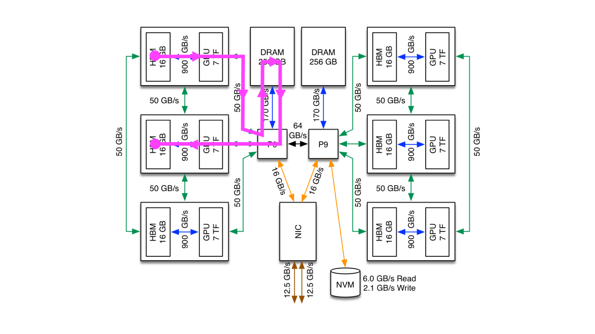
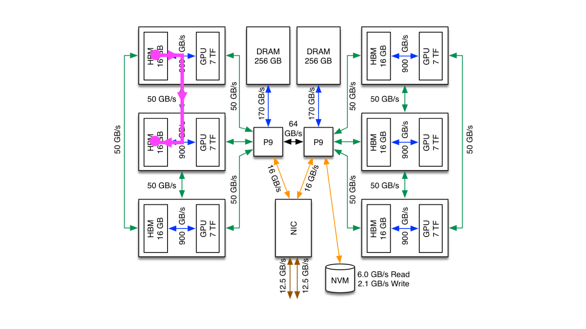

# MPI Ping Pong to Demonstrate CUDA-Aware MPI

In this tutorial, we will look at a simple ping pong code that measures bandwidth for data transfers between 2 MPI ranks. We will look at a CPU-only version, a CUDA version that stages data through CPU memory, and a CUDA-Aware version that passes data directly between GPUs (using GPUDirect).

**NOTE:** This code is not optimized to achieve the best bandwidth results. It is simply meant to demonstrate how to use CUDA-Aware MPI.

## CPU Version

We will begin by looking at a CPU-only version of the code in order to understand the idea behind an MPI ping pong program. Basically, 2 MPI ranks pass data back and forth and the bandwidth is calculated by timing the data transfers and knowing the size of the data being transferred.

Let's look at the `cpu/ping_pong.c` code to see how this is implemented. At the top of the `main` program, we initialize MPI, determine the total number of MPI ranks, determine each rank's ID, and make sure we only have 2 total ranks:

``` c
    /* -------------------------------------------------------------------------------------------
        MPI Initialization 
    --------------------------------------------------------------------------------------------*/
    MPI_Init(&argc, &argv);

    int size;
    MPI_Comm_size(MPI_COMM_WORLD, &size);

    int rank;
    MPI_Comm_rank(MPI_COMM_WORLD, &rank);

    MPI_Status stat;

    if(size != 2){
        if(rank == 0){
            printf("This program requires exactly 2 MPI ranks, but you are attempting to use %d! Exiting...\n", size);
        }
        MPI_Finalize();
        exit(0);
    }
```

Next, we enter our main `for` loop, where each iteration of the loop performs data transfers and bandwidth calculations for a different message size, ranging from 8 B to 1 GB (note that each element of the array is a double-precision variable of size 8 B, and `1 << i` can be read as "2 raised to the i power"):

``` c
    /* -------------------------------------------------------------------------------------------
        Loop from 8 B to 1 GB
    --------------------------------------------------------------------------------------------*/

    for(int i=0; i<=27; i++){

        long int N = 1 << i;

        // Allocate memory for A on CPU
        double *A = (double*)malloc(N*sizeof(double));
        
        ...
```

We then initialize the array `A`, set some tags to match MPI Send/Receive pairs, set `loop_count` (used later), and run a warm-up loop 5 times to remove any MPI setup costs:

``` c
        // Initialize all elements of A to random values
        for(int i=0; i<N; i++){
            A[i] = (double)rand()/(double)RAND_MAX;
        }

        int tag1 = 10;
        int tag2 = 20;

        int loop_count = 50;

        // Warm-up loop
        for(int i=1; i<=5; i++){
            if(rank == 0){
                MPI_Send(A, N, MPI_DOUBLE, 1, tag1, MPI_COMM_WORLD);
                MPI_Recv(A, N, MPI_DOUBLE, 1, tag2, MPI_COMM_WORLD, &stat);
            }
            else if(rank == 1){
                MPI_Recv(A, N, MPI_DOUBLE, 0, tag1, MPI_COMM_WORLD, &stat);
                MPI_Send(A, N, MPI_DOUBLE, 0, tag2, MPI_COMM_WORLD);
            }
        }
```

If you are not familiar with MPI, the MPI calls in the warm-up above loop might be a bit confusing, so an explanation here might be helpful. Essentially, each iteration of the warm-up loop is doing the following:

* If you are MPI rank 0, first send a message (the data in your array `A`) to MPI rank 1, and then expect to receive a message back from MPI rank 1 (the data in MPI rank 1's copy of array `A`). 

* If you are MPI rank 1, first expect to receive a message from rank 0 (the data in MPI rank 0's copy of array `A`), and then send a message back to MPI rank 0 (the data in your copy of array `A`).

The two bullet points above describe one "ping pong" data transfer between the MPI ranks (although these were just part of the warm-up loop). 

Getting back to the code, now we actually perform the ping-pong send and receive pairs `loop_count` times while timing the execution:

```c
        // Time ping-pong for loop_count iterations of data transfer size 8*N bytes
        double start_time, stop_time, elapsed_time;
        start_time = MPI_Wtime();

        for(int i=1; i<=loop_count; i++){
            if(rank == 0){
                MPI_Send(A, N, MPI_DOUBLE, 1, tag1, MPI_COMM_WORLD);
                MPI_Recv(A, N, MPI_DOUBLE, 1, tag2, MPI_COMM_WORLD, &stat);
            }
            else if(rank == 1){
                MPI_Recv(A, N, MPI_DOUBLE, 0, tag1, MPI_COMM_WORLD, &stat);
                MPI_Send(A, N, MPI_DOUBLE, 0, tag2, MPI_COMM_WORLD);
            }
        }

        stop_time = MPI_Wtime();
        elapsed_time = stop_time - start_time;
```

Then, from the timing results and the known size of the data transfers, we calculate the bandwidth and print the results:

```c
        long int num_B = 8*N;
        long int B_in_GB = 1 << 30;
        double num_GB = (double)num_B / (double)B_in_GB;
        double avg_time_per_transfer = elapsed_time / (2.0*(double)loop_count);

        if(rank == 0) printf("Transfer size (B): %10li, Transfer Time (s): %15.9f, Bandwidth (GB/s): %15.9f\n", num_B, avg_time_per_transfer, num_GB/avg_time_per_transfer );
```

And, of course, we must free the allocated memory, finalize MPI, and exit the program:

```c
        free(A);
    }

    MPI_Finalize();

    return 0;
}
```
### Results

Running this code on Summit yields the following results:

```c
Transfer size (B):          8, Transfer Time (s):     0.000000866, Bandwidth (GB/s):     0.008604834
Transfer size (B):         16, Transfer Time (s):     0.000000954, Bandwidth (GB/s):     0.015614021
Transfer size (B):         32, Transfer Time (s):     0.000000801, Bandwidth (GB/s):     0.037217958
Transfer size (B):         64, Transfer Time (s):     0.000000944, Bandwidth (GB/s):     0.063143770
Transfer size (B):        128, Transfer Time (s):     0.000000614, Bandwidth (GB/s):     0.194074658
Transfer size (B):        256, Transfer Time (s):     0.000000543, Bandwidth (GB/s):     0.438679164
Transfer size (B):        512, Transfer Time (s):     0.000000604, Bandwidth (GB/s):     0.789064065
Transfer size (B):       1024, Transfer Time (s):     0.000000638, Bandwidth (GB/s):     1.495130605
Transfer size (B):       2048, Transfer Time (s):     0.000000735, Bandwidth (GB/s):     2.594737042
Transfer size (B):       4096, Transfer Time (s):     0.000001039, Bandwidth (GB/s):     3.672554470
Transfer size (B):       8192, Transfer Time (s):     0.000001340, Bandwidth (GB/s):     5.691813849
Transfer size (B):      16384, Transfer Time (s):     0.000003743, Bandwidth (GB/s):     4.076747560
Transfer size (B):      32768, Transfer Time (s):     0.000004754, Bandwidth (GB/s):     6.418955979
Transfer size (B):      65536, Transfer Time (s):     0.000006878, Bandwidth (GB/s):     8.874576996
Transfer size (B):     131072, Transfer Time (s):     0.000011319, Bandwidth (GB/s):    10.784259681
Transfer size (B):     262144, Transfer Time (s):     0.000020535, Bandwidth (GB/s):    11.889026561
Transfer size (B):     524288, Transfer Time (s):     0.000035697, Bandwidth (GB/s):    13.678342615
Transfer size (B):    1048576, Transfer Time (s):     0.000067051, Bandwidth (GB/s):    14.564560915
Transfer size (B):    2097152, Transfer Time (s):     0.000130098, Bandwidth (GB/s):    15.012707619
Transfer size (B):    4194304, Transfer Time (s):     0.000253810, Bandwidth (GB/s):    15.390456458
Transfer size (B):    8388608, Transfer Time (s):     0.000558763, Bandwidth (GB/s):    13.981780467
Transfer size (B):   16777216, Transfer Time (s):     0.001188749, Bandwidth (GB/s):    13.144070659
Transfer size (B):   33554432, Transfer Time (s):     0.002449044, Bandwidth (GB/s):    12.760083414
Transfer size (B):   67108864, Transfer Time (s):     0.005215280, Bandwidth (GB/s):    11.984016904
Transfer size (B):  134217728, Transfer Time (s):     0.009999430, Bandwidth (GB/s):    12.500712246
Transfer size (B):  268435456, Transfer Time (s):     0.019972757, Bandwidth (GB/s):    12.517049850
Transfer size (B):  536870912, Transfer Time (s):     0.039737416, Bandwidth (GB/s):    12.582599598
Transfer size (B): 1073741824, Transfer Time (s):     0.078949097, Bandwidth (GB/s):    12.666389375
```

## CUDA Staged Version

Now that we are familiar with a basic MPI ping pong code, let's look at a version that includes GPUs...

In this example, we still pass data back and forth between two MPI ranks, but this time the data lives in GPU memory. More specifically, MPI rank 0 has a memory buffer in GPU 0's memory and MPI rank 1 has a memory buffer in GPU 1's memory, and they will pass data back and forth between the two GPUs' memories. Here, to get data from GPU 0's memory to GPU 1's memory, we will first stage the data through CPU memory. 

Now, let's take a look at the code to see the differences from the CPU-only version. Before `main`, we define a macro that allows us to check for errors in our CUDA API calls. This isn't important for this tutorial but, in general, it's a good idea to include such error checks.

```c
// Macro for checking errors in CUDA API calls
#define cudaErrorCheck(call)                                                              \
do{                                                                                       \
    cudaError_t cuErr = call;                                                             \
    if(cudaSuccess != cuErr){                                                             \
        printf("CUDA Error - %s:%d: '%s'\n", __FILE__, __LINE__, cudaGetErrorString(cuErr));\
        exit(0);                                                                            \
    }                                                                                     \
}while(0)
```

Similar to the CPU-only version, just inside `main`, we initialize MPI and find each MPI rank's ID, but here we also map the MPI rank to a different GPU (i.e., MPI rank 0 is mapped to GPU 0 and MPI rank 1 is mapped to GPU 1). Notice that we have wrapped the `cudaSetDevice()` call in our `cudaErrorCheck` macro (again, this isn't necessary, just good practice in CUDA programs).

```c
    /* -------------------------------------------------------------------------------------------
        MPI Initialization 
    --------------------------------------------------------------------------------------------*/
    MPI_Init(&argc, &argv);

    int size;
    MPI_Comm_size(MPI_COMM_WORLD, &size);

    int rank;
    MPI_Comm_rank(MPI_COMM_WORLD, &rank);

    MPI_Status stat;

    if(size != 2){
        if(rank == 0){
            printf("This program requires exactly 2 MPI ranks, but you are attempting to use %d! Exiting...\n", size);
        }
        MPI_Finalize();
        exit(0);
    }

    // Map MPI ranks to GPUs
    int num_devices = 0;
    cudaErrorCheck( cudaGetDeviceCount(&num_devices) );
    cudaErrorCheck( cudaSetDevice(rank % num_devices) );
```
Next, we do roughly the same as we did in the CPU-only version: enter our main `for` loop that iterates over the different message sizes, allocate and intialize array `A`, and run our warm-up loop. However, we now have a call to `cudaMalloc` to allocate a memory buffer (`d_A`) on the GPUs and a call to `cudaMemcpy` to transfer the data initialized in array `A` to the GPU array (buffer) `d_A`. The `cudaMemcpy` was needed to get the data to the GPU before starting our ping pong. 

There are also `cudaMemcpy` calls within the if statements of the warm-up loop. These are needed to transfer data from the GPU buffer to the CPU buffer before the CPU buffer is used in the MPI call (and similarly for the transfer back).

```c
    /* -------------------------------------------------------------------------------------------
        Loop from 8 B to 1 GB
    --------------------------------------------------------------------------------------------*/

    for(int i=0; i<=27; i++){

        long int N = 1 << i;
   
        // Allocate memory for A on CPU
        double *A = (double*)malloc(N*sizeof(double));

        // Initialize all elements of A to 0.0
        for(int i=0; i<N; i++){
            A[i] = 0.0;
        }

        double *d_A;
        cudaErrorCheck( cudaMalloc(&d_A, N*sizeof(double)) );
        cudaErrorCheck( cudaMemcpy(d_A, A, N*sizeof(double), cudaMemcpyHostToDevice) );

        int tag1 = 10;
        int tag2 = 20;

        int loop_count = 50;

        // Warm-up loop
        for(int i=1; i<=5; i++){
            if(rank == 0){
                cudaErrorCheck( cudaMemcpy(A, d_A, N*sizeof(double), cudaMemcpyDeviceToHost) );
                MPI_Send(A, N, MPI_DOUBLE, 1, tag1, MPI_COMM_WORLD);
                MPI_Recv(A, N, MPI_DOUBLE, 1, tag2, MPI_COMM_WORLD, &stat);
                cudaErrorCheck( cudaMemcpy(d_A, A, N*sizeof(double), cudaMemcpyHostToDevice) );
            }
            else if(rank == 1){
                MPI_Recv(A, N, MPI_DOUBLE, 0, tag1, MPI_COMM_WORLD, &stat);
                cudaErrorCheck( cudaMemcpy(d_A, A, N*sizeof(double), cudaMemcpyHostToDevice) );
                cudaErrorCheck( cudaMemcpy(A, d_A, N*sizeof(double), cudaMemcpyDeviceToHost) );
                MPI_Send(A, N, MPI_DOUBLE, 0, tag2, MPI_COMM_WORLD);
            }
        }
```

To clarify this, let's look at the following diagram of a Summit node. The magenta line shows the path taken by data as its passed from GPU 0's memory to GPU 1's memory (assuming the top left device is GPU 0 and the one below that is GPU 1). There are 3 steps involved:

* Data must first be transferred from GPU 0's memory into CPU memory
* Then an MPI call is used to pass the data from MPI rank 0 to MPI rank 1 (in CPU memory)
* Now that MPI rank 1 has the data (in CPU memory), it can transfer the data to GPU 1's memory

Or, more explicitly:

* MPI rank 0 must first transfer the data from a buffer in GPU 0's memory into a buffer in CPU memory
* Then, MPI rank 0 can use its CPU buffer to send data to MPI rank 1's CPU buffer
* Now that MPI rank 1 has the data in its CPU memory buffer, it can transfer it to a buffer in GPU 1's memory.



Getting back to the code, we now perform our actual ping pong loop (with the same structure as the warm-up loop we just discussed) while timing the execution:

```c
        // Time ping-pong for loop_count iterations of data transfer size 8*N bytes
        double start_time, stop_time, elapsed_time;
        start_time = MPI_Wtime();
   
        for(int i=1; i<=loop_count; i++){
            if(rank == 0){
                cudaErrorCheck( cudaMemcpy(A, d_A, N*sizeof(double), cudaMemcpyDeviceToHost) );
                MPI_Send(A, N, MPI_DOUBLE, 1, tag1, MPI_COMM_WORLD);
                MPI_Recv(A, N, MPI_DOUBLE, 1, tag2, MPI_COMM_WORLD, &stat);
                cudaErrorCheck( cudaMemcpy(d_A, A, N*sizeof(double), cudaMemcpyHostToDevice) );
            }
            else if(rank == 1){
                MPI_Recv(A, N, MPI_DOUBLE, 0, tag1, MPI_COMM_WORLD, &stat);
                cudaErrorCheck( cudaMemcpy(d_A, A, N*sizeof(double), cudaMemcpyHostToDevice) );
                cudaErrorCheck( cudaMemcpy(A, d_A, N*sizeof(double), cudaMemcpyDeviceToHost) );
                MPI_Send(A, N, MPI_DOUBLE, 0, tag2, MPI_COMM_WORLD);
            }
        }

        stop_time = MPI_Wtime();
        elapsed_time = stop_time - start_time;
```

Similar to the CPU-only case, from the timing results and the known size of the data transfers, we calculate the bandwidth and print the results:

```c
        long int num_B = 8*N;
        long int B_in_GB = 1 << 30;
        double num_GB = (double)num_B / (double)B_in_GB;
        double avg_time_per_transfer = elapsed_time / (2.0*(double)loop_count);

        if(rank == 0) printf("Transfer size (B): %10li, Transfer Time (s): %15.9f, Bandwidth (GB/s): %15.9f\n", num_B, avg_time_per_transfer, num_GB/avg_time_per_transfer );
```

And finally, we free the memory on both the CPU and GPU, finalize MPI, and exit the program.

```c
        cudaErrorCheck( cudaFree(d_A) );
        free(A);
    }

    MPI_Finalize();

    return 0;
}
```

### Results

Running this code yields the results below. The lower bandwidth obtained in this example is not surprising considering the data transfers between CPU and GPU that are not present in the CPU only version. 

```c
Transfer size (B):          8, Transfer Time (s):     0.000031405, Bandwidth (GB/s):     0.000237238
Transfer size (B):         16, Transfer Time (s):     0.000031500, Bandwidth (GB/s):     0.000473056
Transfer size (B):         32, Transfer Time (s):     0.000031253, Bandwidth (GB/s):     0.000953594
Transfer size (B):         64, Transfer Time (s):     0.000031277, Bandwidth (GB/s):     0.001905674
Transfer size (B):        128, Transfer Time (s):     0.000030981, Bandwidth (GB/s):     0.003847860
Transfer size (B):        256, Transfer Time (s):     0.000031053, Bandwidth (GB/s):     0.007677847
Transfer size (B):        512, Transfer Time (s):     0.000031447, Bandwidth (GB/s):     0.015163110
Transfer size (B):       1024, Transfer Time (s):     0.000031438, Bandwidth (GB/s):     0.030335168
Transfer size (B):       2048, Transfer Time (s):     0.000031780, Bandwidth (GB/s):     0.060016886
Transfer size (B):       4096, Transfer Time (s):     0.000033170, Bandwidth (GB/s):     0.115003491
Transfer size (B):       8192, Transfer Time (s):     0.000033989, Bandwidth (GB/s):     0.224466891
Transfer size (B):      16384, Transfer Time (s):     0.000038330, Bandwidth (GB/s):     0.398084800
Transfer size (B):      32768, Transfer Time (s):     0.000041540, Bandwidth (GB/s):     0.734657127
Transfer size (B):      65536, Transfer Time (s):     0.000048461, Bandwidth (GB/s):     1.259469903
Transfer size (B):     131072, Transfer Time (s):     0.000061390, Bandwidth (GB/s):     1.988446644
Transfer size (B):     262144, Transfer Time (s):     0.000081654, Bandwidth (GB/s):     2.989952549
Transfer size (B):     524288, Transfer Time (s):     0.000131619, Bandwidth (GB/s):     3.709813882
Transfer size (B):    1048576, Transfer Time (s):     0.000211197, Bandwidth (GB/s):     4.623936913
Transfer size (B):    2097152, Transfer Time (s):     0.000355879, Bandwidth (GB/s):     5.488169482
Transfer size (B):    4194304, Transfer Time (s):     0.000747434, Bandwidth (GB/s):     5.226212107
Transfer size (B):    8388608, Transfer Time (s):     0.001695559, Bandwidth (GB/s):     4.607624607
Transfer size (B):   16777216, Transfer Time (s):     0.003465020, Bandwidth (GB/s):     4.509353233
Transfer size (B):   33554432, Transfer Time (s):     0.007005371, Bandwidth (GB/s):     4.460862842
Transfer size (B):   67108864, Transfer Time (s):     0.014682284, Bandwidth (GB/s):     4.256830800
Transfer size (B):  134217728, Transfer Time (s):     0.034339137, Bandwidth (GB/s):     3.640161378
Transfer size (B):  268435456, Transfer Time (s):     0.067559225, Bandwidth (GB/s):     3.700456901
Transfer size (B):  536870912, Transfer Time (s):     0.132207124, Bandwidth (GB/s):     3.781944463
Transfer size (B): 1073741824, Transfer Time (s):     0.262666065, Bandwidth (GB/s):     3.807115313
```

## CUDA-Aware Version

Before looking at this code example, let's first describe CUDA-Aware MPI and GPUDirect. These two topics are often used interchangeably, and although they can be related, they are distinct topics. 

CUDA-Aware MPI is an MPI implementation that allows GPU buffers (e.g., GPU memory allocated with `cudaMalloc`) to be used directly in MPI calls. However, CUDA-Aware MPI by itself does not specify whether data is staged through CPU memory or passed directly from GPU to GPU. That's where GPUDirect comes in! 

GPUDirect can enhance CUDA-Aware MPI by allowing data transfers directly between GPUs on the same node (peer-to-peer) or directly between GPUs on different nodes (RDMA support) without the need to stage data through CPU memory. 

Now let's take a look at the code. It's essentially the same as the CUDA staged version but now there are no calls to `cudaMemcpy` during the ping pong steps. Instead, we use our GPU buffers (`d_A`) directly in the MPI calls:

```c
        // Time ping-pong for loop_count iterations of data transfer size 8*N bytes
        double start_time, stop_time, elapsed_time;
        start_time = MPI_Wtime();

        for(int i=1; i<=loop_count; i++){
            if(rank == 0){
                MPI_Send(d_A, N, MPI_DOUBLE, 1, tag1, MPI_COMM_WORLD);
                MPI_Recv(d_A, N, MPI_DOUBLE, 1, tag2, MPI_COMM_WORLD, &stat);
            }
            else if(rank == 1){
                MPI_Recv(d_A, N, MPI_DOUBLE, 0, tag1, MPI_COMM_WORLD, &stat);
                MPI_Send(d_A, N, MPI_DOUBLE, 0, tag2, MPI_COMM_WORLD);
            }
        }

        stop_time = MPI_Wtime();
        elapsed_time = stop_time - start_time;
```

### Results

There is a noticeable improvement in bandwidth relative to the CUDA staged version. This is because Summit has GPUDirect support (both peer-to-peer and RDMA) that allows data transfers between peer GPUs across NVLink.

```c
Transfer size (B):          8, Transfer Time (s):     0.000023285, Bandwidth (GB/s):     0.000319968
Transfer size (B):         16, Transfer Time (s):     0.000022864, Bandwidth (GB/s):     0.000651721
Transfer size (B):         32, Transfer Time (s):     0.000022066, Bandwidth (GB/s):     0.001350614
Transfer size (B):         64, Transfer Time (s):     0.000021910, Bandwidth (GB/s):     0.002720440
Transfer size (B):        128, Transfer Time (s):     0.000021974, Bandwidth (GB/s):     0.005425002
Transfer size (B):        256, Transfer Time (s):     0.000021859, Bandwidth (GB/s):     0.010906970
Transfer size (B):        512, Transfer Time (s):     0.000021851, Bandwidth (GB/s):     0.021822642
Transfer size (B):       1024, Transfer Time (s):     0.000021901, Bandwidth (GB/s):     0.043544172
Transfer size (B):       2048, Transfer Time (s):     0.000021715, Bandwidth (GB/s):     0.087836679
Transfer size (B):       4096, Transfer Time (s):     0.000021824, Bandwidth (GB/s):     0.174796899
Transfer size (B):       8192, Transfer Time (s):     0.000021769, Bandwidth (GB/s):     0.350462892
Transfer size (B):      16384, Transfer Time (s):     0.000021730, Bandwidth (GB/s):     0.702213060
Transfer size (B):      32768, Transfer Time (s):     0.000021875, Bandwidth (GB/s):     1.395117345
Transfer size (B):      65536, Transfer Time (s):     0.000022900, Bandwidth (GB/s):     2.665275249
Transfer size (B):     131072, Transfer Time (s):     0.000024108, Bandwidth (GB/s):     5.063377202
Transfer size (B):     262144, Transfer Time (s):     0.000026803, Bandwidth (GB/s):     9.108750160
Transfer size (B):     524288, Transfer Time (s):     0.000032308, Bandwidth (GB/s):    15.113262703
Transfer size (B):    1048576, Transfer Time (s):     0.000043602, Bandwidth (GB/s):    22.397425198
Transfer size (B):    2097152, Transfer Time (s):     0.000065720, Bandwidth (GB/s):    29.718880055
Transfer size (B):    4194304, Transfer Time (s):     0.000110288, Bandwidth (GB/s):    35.418609771
Transfer size (B):    8388608, Transfer Time (s):     0.000200170, Bandwidth (GB/s):    39.029370637
Transfer size (B):   16777216, Transfer Time (s):     0.000378465, Bandwidth (GB/s):    41.285197534
Transfer size (B):   33554432, Transfer Time (s):     0.000735136, Bandwidth (GB/s):    42.509119599
Transfer size (B):   67108864, Transfer Time (s):     0.001448561, Bandwidth (GB/s):    43.146273061
Transfer size (B):  134217728, Transfer Time (s):     0.002878520, Bandwidth (GB/s):    43.425097318
Transfer size (B):  268435456, Transfer Time (s):     0.005728381, Bandwidth (GB/s):    43.642346264
Transfer size (B):  536870912, Transfer Time (s):     0.011432438, Bandwidth (GB/s):    43.735204395
Transfer size (B): 1073741824, Transfer Time (s):     0.022840518, Bandwidth (GB/s):    43.781843371
```

The magenta line in the following diagram shows how the data is transferred between the two GPUs across NVLink, which is the reason for the improved performance. 



### Additional Notes

* In order to enable CUDA-Aware MPI on Summit, you must pass the `--smpiargs="-gpu"` flag to `jsrun`
